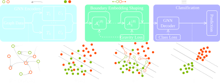

<div align="center">

<h1>Boundary Embedding Shaping (BES)</h1>

<p><em>Adaptive Contrastive Learning for Graph Structural Disentanglement</em></p>

[](https://arxiv.org/abs/2606.20283)
[](https://icml.cc)
[](https://python.org)
[](https://pytorch.org)
[](https://pyg.org)

<br/>


<sub>BES identifies boundary nodes and uses contrastive gravity loss to sharpen decision boundaries,<br/>suppressing spurious structural noise with minimal parameter perturbation.</sub>

</div>


# Overview

<div style="text-align: justify">

Graph Neural Networks excel at aggregating neighborhood information, yet their performance degrades near class boundaries where **graph structural entanglement** is most severe — spurious correlations from semantically irrelevant neighbors contaminate node embeddings and blur decision boundaries.


BES is a **plug-in module** that sits on top of any pretrained GNN encoder and selectively refines only the embeddings that matter most: nodes at the decision boundary. It achieves this through three tightly coupled steps — boundary detection, contrastive shaping, and adaptive gradient scaling — with negligible overhead and no need for data augmentation.


> **Key result:** BES improves GCN node-classification accuracy by an average of **+3.3%** across benchmarks, up to **+5.0% on WikiCS**, while also achieving state-of-the-art link prediction accuracy.

</div>


# Method

<div align="center">



</div>

<div style="text-align: justify">

BES decomposes the latent space into **invariant** factors (class-determining structure) and **variant** factors (topological noise), then maximises the former while suppressing the latter — but only where the payoff is highest: near class boundaries.

</div>

<table>
<tr>
<td width="33%" valign="top">

### Boundary Detection

<div style="text-align: justify">

Nodes near class boundaries are identified via a **Mahalanobis slab criterion**:

```math
\mathcal{B} = \left\{ x \;\middle|\; \left|(\mu_m - \mu_n)^\top \Sigma^{-1} \Phi (x) \right| \leq \delta \right\}
```

Within this region, nodes whose k-NN neighbourhood has >50% cross-class neighbours (shift score `S(v) > 0.5`) are selected as *hard boundary nodes* for targeted shaping.

</div>

</td>
<td width="40%" valign="top">

### Gravity Loss

<div style="text-align: justify">

An InfoNCE-style loss acting only on boundary nodes, using **class centroids** as proxy anchors:

```math
\begin{aligned}
&\text{sim}^{pos} = -\left[\max\!\left(0,\, d(\Phi (x_b),\mu_b) - \min_{j \neq b, x_j \in \mathcal{B}} d(\Phi (x_j),\mu_b)\right)\right]^2  \\ \\
&\text{sim}^{neg} = -\| \Phi (x_b) - \mu_j\|^2 \quad (j \neq b)  \\ \\
&\mathcal{L} = -\log \frac{\exp(\text{sim}^{pos}/\tau)}{\sum_{j} \exp(\text{sim}^{neg}/\tau)} 
\end{aligned}
```
The margin in $\text{sim}^{pos}$ zeroes out the gradient for nodes already correctly separated — no wasted updates.

</div>

</td>
<td width="33%" valign="top">

### Adaptive Scaling

<div style="text-align: justify">

To prevent overshooting, gradient updates are scaled by the inverse of total embedding displacement Δ<sup>(B)</sup>:


```math
\theta \leftarrow \theta + \frac{\alpha}{\Delta^{(B)}} \cdot \eta \cdot \nabla\mathcal{L}
```

A virtual pre-update measures Δ<sup>(B)</sup> before committing, so larger perturbations receive smaller step sizes. This directly operationalises the theoretical error bound from Proposition 3.1.

</div>

</td>
</tr>
</table>


# Results

Node classification (NC) and link prediction (LP) accuracy (%) on standard benchmarks. **Bold** = 1st.

<div align="center">

| Method | Cora NC | Cora LP | CiteSeer NC | CiteSeer LP | PubMed NC | PubMed LP | WikiCS NC | WikiCS LP |
|:---|:---:|:---:|:---:|:---:|:---:|:---:|:---:|:---:|
| GCN | 87.74 | 92.30 | 75.74 | 95.30 | 87.36 | 93.70 | 80.48 | 91.89 |
| GAT | 87.18 | 90.39 | 76.24 | 92.35 | 86.81 | 89.07 | 80.88 | 90.87 |
| GraphSAGE | 87.74 | 90.67 | 75.89 | 88.50 | 88.86 | 88.30 | 81.30 | 90.15 |
| SGC | 88.29 | 91.65 | 77.99 | 94.31 | 87.71 | 86.94 | 80.11 | 92.00 |
| H2GCN | 88.69 | 92.27 | 77.74 | 94.97 | 88.77 | 95.73 | 76.27 | 92.04 |
| SGNN | 87.74 | 93.38 | 77.34 | 96.07 | 83.46 | 94.60 | 74.36 | 91.01 |
| MPNN-GCN | 85.52 | 90.97 | 76.04 | 93.85 | 89.76 | 86.73 | 84.05 | 89.05 |
| GraphECL | 88.72 | 92.98 | 75.39 | 95.22 | 88.18 | 94.13 | 81.28 | 51.99 |
| IGCL | 88.60 | 92.98 | 77.30 | 95.60 | 87.32 | 96.88 | 82.99 | 89.81 |
| **BES (Ours)** | **89.46** | **94.45** | **78.40** | **96.27** | **91.03** | **97.89** | **85.52** | **92.27** |

</div>


# Quick Start

### Requirements

```bash
pip install torch torch-geometric scikit-learn numpy matplotlib
```

### Datasets

Preprocessed datasets are included in `data/` and loaded automatically:

| Dataset | Nodes | Classes | Features |
|:---|---:|---:|---:|
| Cora | 2,708 | 7 | 1,433 |
| CiteSeer | 3,327 | 6 | 3,703 |
| PubMed | 19,717 | 3 | 500 |
| WikiCS | 11,701 | 10 | 300 |

### Run on Single Dataset

```bash
python main.py --dataset Cora --seeds 42
```

### Run on All Datasets

```bash
chmod +x run.sh && bash run.sh
```

Results are written to `result_NC/{dataset}_{seed}_summary.txt`.

### Key Hyperparameters

| Argument | Default | Description |
|:---|:---:|:---|
| `--dataset` | — | `Cora` / `CiteSeer` / `PubMed` / `WikiCS` |
| `--epochs` | `200` | Training epochs |
| `--lr` | `1e-4` | Learning rate for the boundary attention layer |
| `--seeds` | `42` | Random seed |


# Citation

```bibtex
@inproceedings{chen2026boundary,
  title     = {Boundary Embedding Shaping with Adaptive Contrastive Learning
               for Graph Structural Disentanglement},
  author    = {Chen, Jiaqing and Yin, Zidu and Cai, Yichao and Liu, Yuhang
               and Zhang, Zhen and Gong, Dong and Shi, Javen Qinfeng},
  booktitle = {Proceedings of the 43rd International Conference on Machine Learning},
  year      = {2026},
}
```